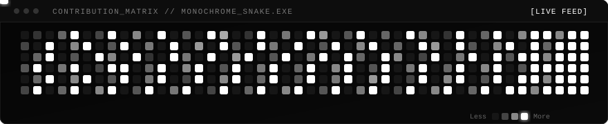

<div align="center">

<!-- ANIMATED CYBER GLOW HEADER BANNER -->


<!-- ANIMATED TYPING TERMINAL -->
<p align="center">
  <a href="https://github.com/SevenArtMoscow">
    
  </a>
</p>

<!-- QUICK MONOCHROME BADGES -->
<p align="center">
  <a href="https://github.com/SevenArtMoscow?tab=repositories">
    
  </a>
  
  <a href="mailto:sasasnaratova@gmail.com">
    
  </a>
  
</p>

<!-- ANIMATED GLOWING LASER DIVIDER -->


</div>

<br/>

<!-- TERMINAL PHILOSOPHY / MANIFESTO -->
<p align="center">
  
</p>

<br/>

### 🌑 System Identity & Parameters

```yaml
identity:
  handle: "SevenArtMoscow"
  engineer: "Alexandra"
  archetype: "Full-Stack Architect & Bot Engineer"
  coordinates: "Moscow, Earth [55.7558° N, 37.6173° E]"
  aesthetic: "Dark Mode Supremacy • Monochrome • High Contrast"
  doctrine: "Write clean code, eliminate friction, engineer perfection."
```

- ⚡ **Core Focus**: Developing high-throughput Telegram bots, async architectures, and fluid dark-mode web interfaces.
- 🌑 **Design Philosophy**: Minimalist noir, glowing luminescence, maximum readability and 60 FPS interactions.
- ⚙️ **Under the Hood**: Deep understanding of Python concurrency (`asyncio`, `aiogram`), modern frontend systems (`Next.js`, `TypeScript`), and distributed microservices.
- 💬 **Ask Me About**: Bot ecosystem scalability, backend optimization, bespoke modern UX/UI.

<br/>

<div align="center">

<!-- ANIMATED GLOWING LASER DIVIDER -->


### 🐍 Neural Contribution Grid



<!-- ANIMATED GLOWING LASER DIVIDER -->


### ⚔️ Tech Arsenal & Stack

<p>
  <strong>🌐 Languages &amp; Core</strong><br/>
  
  
  
  
  
</p>

<p>
  <strong>⚡ Frameworks &amp; Frontend</strong><br/>
  
  
  
  
  
</p>

<p>
  <strong>🤖 Bots &amp; Backend Infrastructure</strong><br/>
  
  
  
  
  
</p>

<p>
  <strong>🧰 Tools &amp; Development Workflow</strong><br/>
  
  
  
  
  
</p>

<!-- ANIMATED GLOWING LASER DIVIDER -->


</div>

### 🚀 Selected Operations & Repositories

| Operation / Project | Mission Brief | Tech Stack |
| :--- | :--- | :--- |
| ☕ **[tumbler-sever](https://github.com/SevenArtMoscow/tumbler-sever)** | Specialty coffee digital showcase & landing experience | `HTML5` `CSS3` `JavaScript` |
| 🤖 **[telegram-mentor-bot](https://github.com/SevenArtMoscow/telegram-mentor-bot)** | Interactive Telegram system for collecting & curating mentor stories | `Python` `Aiogram` `AsyncIO` |
| 🎓 **[spirkina](https://github.com/SevenArtMoscow/spirkina)** | Web application for Olga Spirkina Media School platform | `TypeScript` `React / Next.js` `CSS3` |
| 🗳️ **[voting-bot](https://github.com/SevenArtMoscow/voting-bot)** | High-concurrency voting and polling engine with management dashboard | `Python` `Docker` `HTML5` |
| ⚡ **[tumbler-raid](https://github.com/SevenArtMoscow/tumbler-raid)** | High-impact interactive promotional platform & web showcase | `HTML5` `CSS3` `JavaScript` |

<br/>

<div align="center">

<!-- ANIMATED GLOWING LASER DIVIDER -->


### 📊 Streak & Momentum

<p align="center">
  
</p>

<!-- ANIMATED FOOTER BANNER -->


</div>
